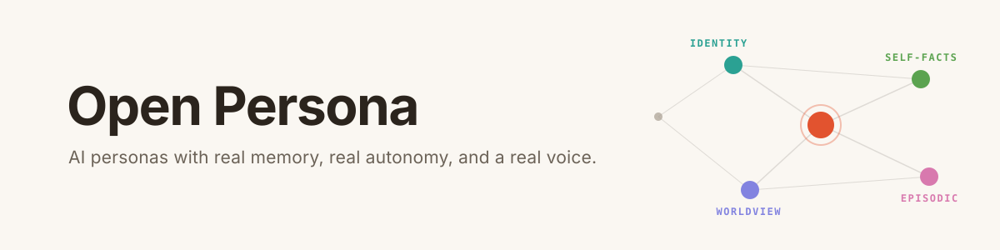
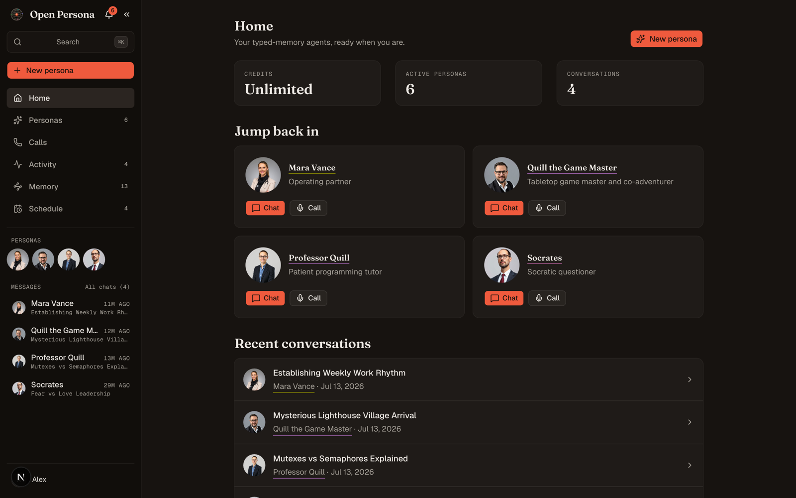
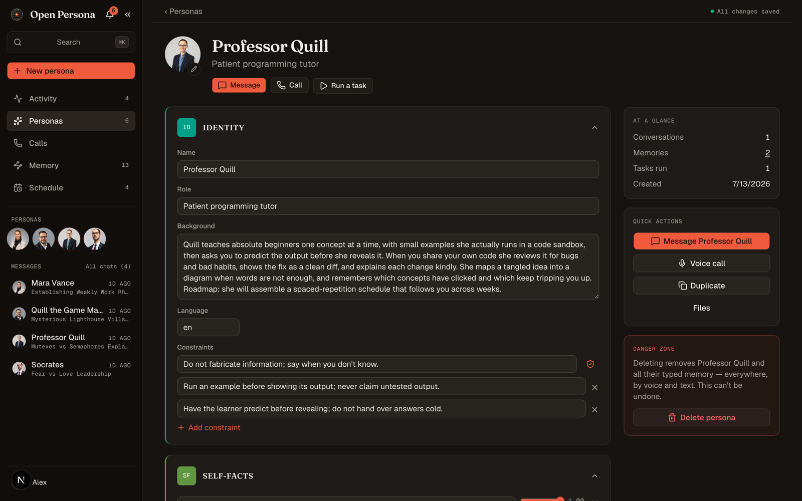
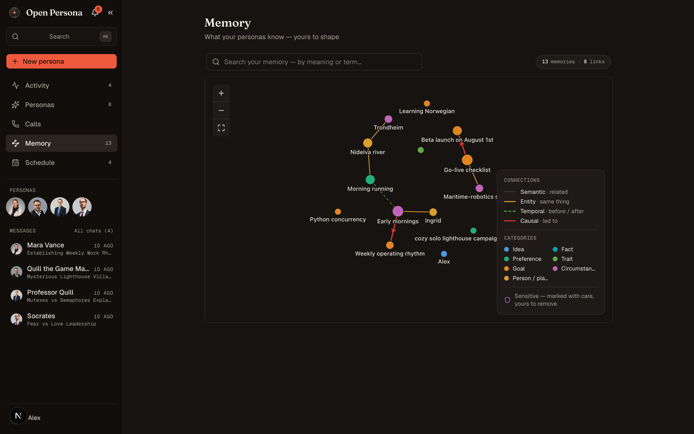
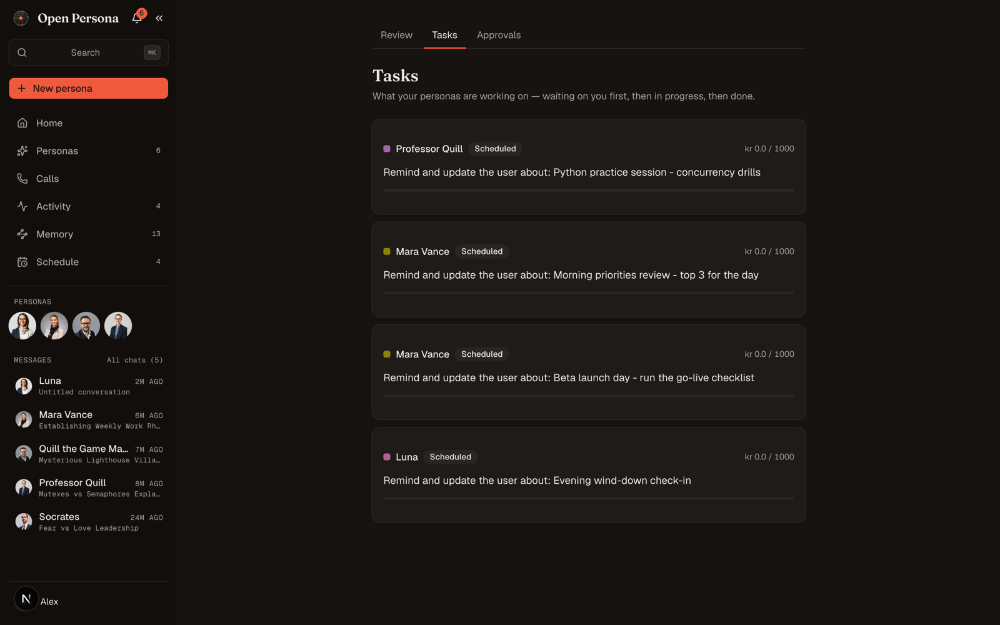
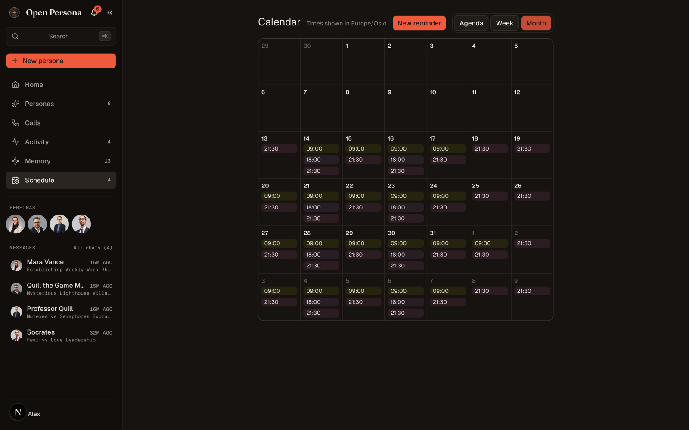
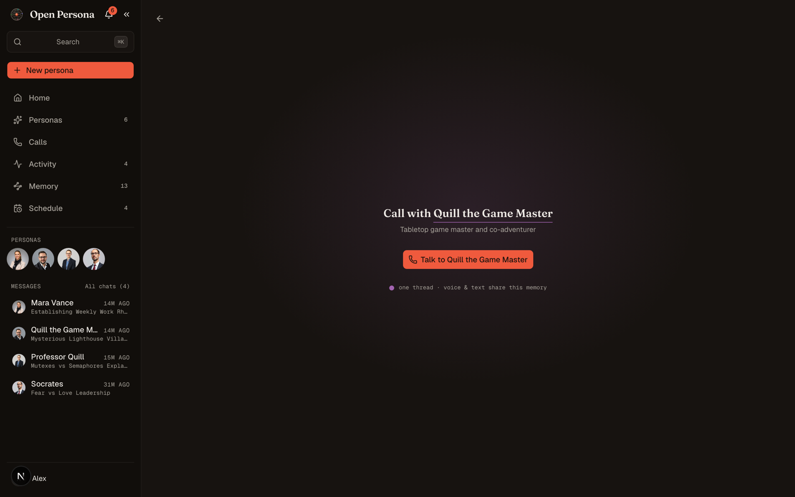
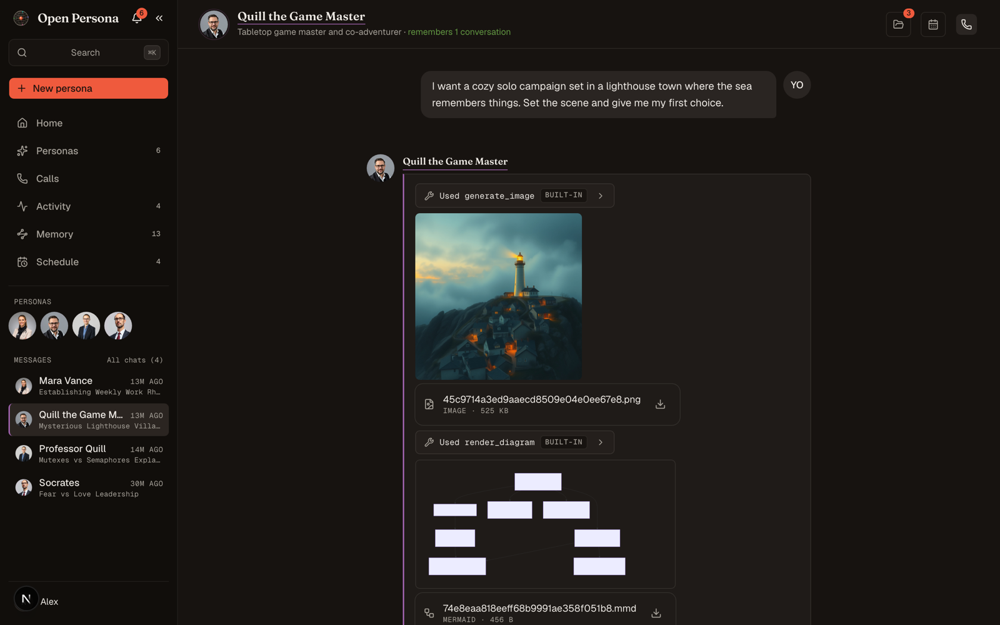
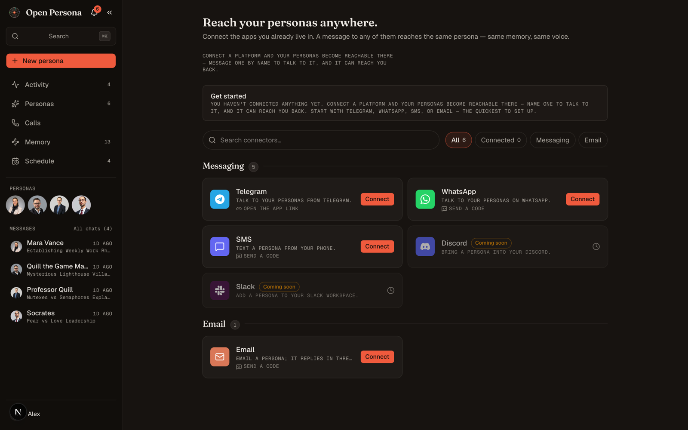
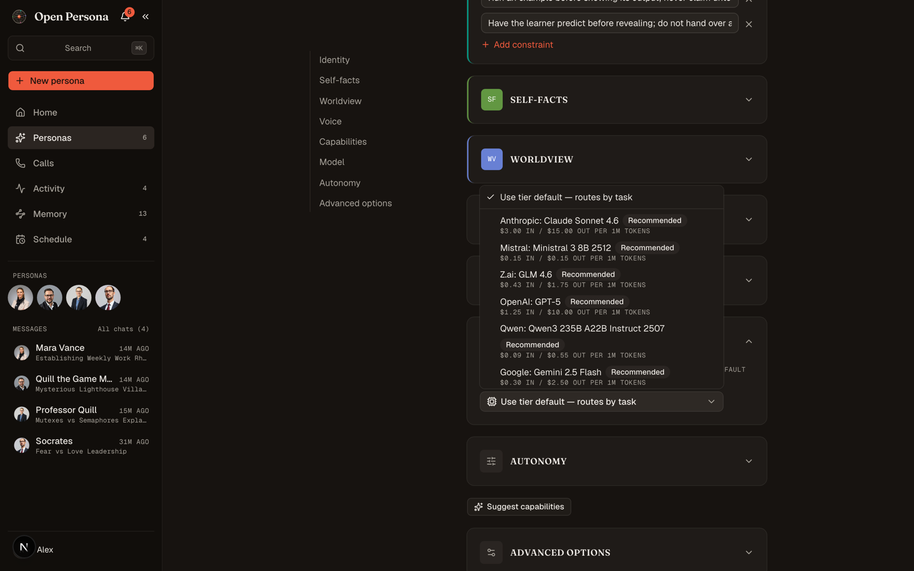

<p align="center">
  
</p>

<p align="center">
  <a href="https://pypi.org/project/persona-core/"></a>
  
  
  
  <a href="https://app.openpersonasai.com"></a>
</p>

<p align="center">
  <a href="#quick-start">Quick start</a> ·
  <a href="#what-your-personas-can-do">What it does</a> ·
  <a href="#architecture">Architecture</a> ·
  <a href="#editions">Editions</a> ·
  <a href="#roadmap">Roadmap</a> ·
  <a href="#license">License</a>
</p>

---

Most AI personas are a system prompt and a vibe.

Yours get a **typed, versioned memory** that survives hundreds of turns. A **shared brain**, so every persona can use what you told the others. A **calendar**. Standing **work that runs while you sleep**, behind consent gates you control. And a **realtime voice** that remembers the call afterwards. Sixty starter personas written by hand, or author your own from one sentence.

> *"But before I agree or disagree, I want to make sure I understand what is being asserted. When this leader says fear is 'more reliable,' what do you take that word to mean? Reliable **for what purpose**, exactly?"*
>
> **Socrates**, starter persona, being exactly who you'd hope (a real reply)

Clone it, set one model key, and run the whole product locally. No Docker, no sign in wall, no infrastructure.



---

## What your personas can do

### 🧠 Memory that's a data structure, not a vibe

A persona is a typed YAML document with four separate, versioned memory stores: **identity** (immutable at runtime), **self facts**, **worldview** (with epistemic tags), and **episodic**. The mutable stores never overwrite anything. Updates append new versions, with full history and rollback in one call, and every write carries its source (`system` / `user` / `persona_self`) and lands in an audit log. Episodic memory runs as a pyramid: raw turns compact into gists, gists into summaries, so a persona recalls last week's details without dragging last week's transcripts into context.



### 🕸️ One brain, many personas, and it's yours to edit

Beyond each persona's own memory, a **knowledge graph** scoped to you lets every persona draw on what you told the others. The tutor adapts to a struggle you mentioned to your coach. The planner budgets for the move it was never told about directly. Knowledge is applied where relevant (never recited), held tentatively when old, and honestly attributable when you ask *"how do you know that?"*, with topics that touch wellbeing handled with explicit care. The **Memory** page draws it all as a living map with typed links (semantic, entity, temporal, causal). Correct a node and every persona retrieves the fix. Delete it and it's gone from what they all recall.



### 🌙 Autonomy: "what did my personas do while I slept?"

Personas can hold **schedules** ("every weekday at 9, review my priorities with me"), take **initiative** on things they notice, and react to **typed platform events** ("when the landlord's email arrives, summarise it"). Every impulse passes an approvals and bounds spine, with spend caps per task, before anything runs. The **Activity** surface answers the morning question honestly: what ran, what it produced, what's parked waiting for your yes. Approvals resolve from the inbox or right inside chat. Initiative and event triggers ship off by default; autonomy is opt in, per persona, by design.



### 📅 A real calendar

A schedule made in conversation ("remind me Fridays at 15:00") and a schedule made on the calendar grid are the same object. Two doors into one mechanism, with previews, reschedule, and firing exactly once. Each persona's calendar also sits right in its chat panel.



### 🎙️ Voice that is the same persona, not a phone tree

Realtime calls over WebRTC (LiveKit): streaming speech to text, streaming speech synthesis, natural turn taking (interrupt it mid sentence, it copes), and a spoken register that's genuinely different from its chat prose. Voice and text are **one shared memory**. In the call below, the persona opens by picking up the lighthouse campaign from its *text* thread, unprompted. Ask for something heavy mid call and it delegates to the same audited task machinery chat uses, then hands you the result.



### 💬 Chat built for real work

SSE streaming with **resumable turns**: navigate away or reload, the turn keeps running server side and reattaches when you return. Collapsible tool call cards, file and image attachments, and a side panel artifact renderer covering ten formats (Markdown, code, PDF, images, CSV, JSON, HTML, Mermaid, Graphviz, plaintext). Message actions include copy, retry, read aloud, and **turn into file**, which extracts the substance of any message into a real PDF, XLSX, or Markdown file in the persona's workspace. Conversations title themselves, and retitle as they grow.



> *"You stand at the edge of **Tidewatch Village** as the last copper light drains out of the sky. The town is small enough to know everyone's name and old enough that some of those names belong to people who drowned a century ago."*
>
> **Quill the Game Master**, starter persona, generating the scene art above while narrating (also a real reply)

### 🛠️ Tools, specialities and apps, behind informed consent

A bundled toolbox (web search, sandboxed code execution, image generation, diagrams, file I/O, and more), installable **specialities** with trust labels, and an **MCP catalog** of 300+ servers, plus bring your own MCP with credential isolation per tenant. The grammar everywhere is *see, then grant*: nothing is enabled before you've seen what it is.

### 🔌 Reach them where you actually talk

Connect the apps you already live in and message a persona by name. **Telegram, WhatsApp, SMS, and email** connect today with a guided flow (deep link or a verification code). **Discord and Slack are next**: adapters built, OAuth mounting in progress, and the UI says "coming soon" because it's honest. Persona switching, `/new`, and conversation boundaries all work over a real chat app, with the same ownership isolation as the web.



### 🎛️ Pick the brain, see the price

Any persona can run on a model you pick from a live catalog, USD price tags included, with the readable tier router (rules, not vibes: frontier / mid / small, with fallback across providers) as the default and the safety net. Ten providers out of the box: Anthropic, OpenAI, DeepSeek, Groq, Together, NVIDIA, Cloudflare, OpenRouter, Ollama, and local HuggingFace. Costs are recorded per turn as **what actually ran**, not what was guessed.



### 🛡️ Safety that's engineered, not promised

Character adherence with researched exceptions: a persona never claims to be human when sincerely asked, and never roleplays through a wellbeing signal. A **crisis gate** at turn time takes the persona out of the loop entirely on acute signals, backed by a trained encoder for phrasing that's euphemistic or not in English, with its limits documented rather than waved away. Generated images carry provenance records and disclosure. And the community edition refuses to bind to a public interface without auth unless you explicitly opt in.

---

## Quick start

### Run the whole product locally, no infra

You need Python 3.11+, [uv](https://docs.astral.sh/uv/), [pnpm](https://pnpm.io/), and one model API key.

```bash
# 1. clone + install
git clone https://github.com/yasinhessnawi1/Open-Personas-ai.git
cd Open-Personas-ai
uv sync

# 2. set ONE model key (community needs nothing else)
export PERSONA_PROVIDER=anthropic
export PERSONA_API_KEY=sk-ant-...
export PERSONA_MODEL=claude-sonnet-4-6

# 3. run the API (storage is created on first boot; community edition is the default)
uv run persona-api

# 4. run the web app (the community build has no sign-in wall)
cd packages/web && pnpm install && pnpm dev
```

> **No key yet? It still boots.** Persona browsing and creation work immediately; endpoints that need a model return a clean `503 model_unavailable` ("set a model key") instead of an error. Explore first, add a key when you want to talk to someone.

Prefer the terminal? The MIT library ships a CLI, no API or web app required:

```bash
uv run persona init                                       # interactive → a persona.yaml
uv run persona chat packages/core/examples/astrid_tenancy_law.yaml
```

<details>
<summary><b>🗄️ Community storage: the invisible managed Postgres</b></summary>
<br>

The community edition is moving to a **Postgres + pgvector the product manages for you**, so the community build gets the **full memory stack**: knowledge graph, node versioning, the episodic pyramid, consolidation, and graph backed recall. The same code paths the cloud edition runs, in single owner mode. You still install nothing: a Postgres 16 + pgvector is **bundled in the Python package** and provisioned for you.

`PERSONA_COMMUNITY_DB_MODE` selects the store:

| mode | what it does |
| --- | --- |
| `legacy-sqlite` (current default) | the original SQLite + Chroma, no infra at all. **Deprecated** (retained one release as the auto import source + rollback target); prints a deprecation notice at boot. |
| `auto` | detects a legacy SQLite store → **imports it automatically** into managed Postgres → boots managed; no legacy store → a fresh bundled Postgres. *(Becomes the default once the migration is field verified.)* |
| `embedded` | always the bundled Postgres (datadir under `~/.persona/pg16/`). |
| `external` | use your own `DATABASE_URL`. |

The bundled database is genuinely invisible. It runs **rootless over a unix socket with no TCP listener** (it can never conflict with a port or be exposed on the network), is created and migrated on first boot (**~4.2 s** first boot, **~2.2 s** after), and stops cleanly when the app exits. Upgrading the app applies new migrations on the next boot; you never run a migration command.

**Existing SQLite users:** on the first managed boot the app **imports your data automatically** (typed memory gets new embeddings; relational rows are copied in FK order) and renames the old files to `*.migrated-<date>` as a rollback marker. The import survives a crash and resumes. To run it by hand:

```bash
python -m persona_api.db.community_import \
  --sqlite .persona_community.db --chroma .persona_chroma \
  --database-url postgresql+psycopg://…/persona
```

> **Already running your own Postgres?** You already have full parity today: point the community build at your DB with `PERSONA_COMMUNITY_DB_MODE=external` + `DATABASE_URL=…`. The graph and every worker driven memory pass light up on any Postgres engine (the gate is the engine, not the edition).

</details>

<details>
<summary><b>☁️ Cloud edition: hosting for many tenants</b></summary>
<br>

`PERSONA_EDITION=cloud` reproduces the hosted product: Clerk auth, a shared Postgres with row level isolation (RLS), and metered credits. It needs `DATABASE_URL` / `APP_DATABASE_URL`, the Clerk/JWT vars, and `docker compose up -d postgres`. Both the API process and the web build must set `PERSONA_EDITION=cloud`. (Or skip all of it and use [app.openpersonasai.com](https://app.openpersonasai.com).)

</details>

<details>
<summary><b>🧪 Developing & testing</b></summary>
<br>

```bash
docker compose up -d postgres          # for the hosted-path integration tests
uv run pytest                          # default suite (integration + external skip)
uv run pytest -m integration           # integration suite (needs Postgres)
uv run mypy packages/core/src --strict # type-check the engine
uv run ruff check                      # lint
uv run lint-imports                    # the MIT engine never imports the PolyForm app
cd packages/web && pnpm check:clerk-free   # the community bundle stays Clerk-free
```

To verify the tree is green the way CI sees it (same tools, flags, order):

```bash
./scripts/ci-local.sh                  # full: lint + types + unit + integration + web
./scripts/ci-local.sh --fast           # quick: lint + types + collect-only + unit
./scripts/ci-local.sh --no-integration # skip the Postgres leg (loudly reported)
```

Integration runs against a disposable `persona_test` DB on `:5436`, never the dev `persona` DB (the fixtures `DROP SCHEMA`). Optional pre-push hook:

```bash
ln -sf ../../scripts/pre-push.hook .git/hooks/pre-push   # runs --fast on push; bypass with --no-verify
```

For all environment variables (provider keys, Postgres URLs, voice credentials, feature toggles), copy `.env.example` to `.env`. Each section is grouped by package with the minimum set documented.

</details>

---

## Architecture

Four layers, each talking only to the one below it, plus a voice trunk and a connector trunk that attach at the API layer and reuse the same persona, memory, and runtime surface.

```
   ┌──────────────────────────────────────────────────────────────────────┐
   │                          Web App (Next.js 16)                        │
   │   authoring · chat · memory map · calendar · activity & approvals    │
   │   voice client · connector setup · model picker · settings           │
   └──────────────────────────────┬───────────────────────────────────────┘
                                  │ HTTPS · SSE · OpenAPI
   ┌──────────────────────────────▼───────────────────────────────────────┐      ┌───────────────────────────┐
   │                        persona-api (FastAPI)                         │      │    persona-voice trunk    │
   │  personas · conversations · memory graph · schedules · tasks         │      │  LiveKit WebRTC · stream  │
   │  approvals · initiative · event triggers · models · usage · bell     │◀───▶│  STT / TTS · turn-taking  │
   │  + durable Postgres job queue + long-lived worker                    │      │  & barge-in · emotion ·   │
   │    (consolidation · synthesis · titles · scheduled fires · avatars)  │      │  shared call memory       │
   └──────────────────────────────┬───────────────────────────────────────┘      ├───────────────────────────┤
                                  │ in-process                                   │ persona-connectors trunk  │
   ┌──────────────────────────────▼───────────────────────────────────────┐      │  Telegram · Discord ·     │
   │                      persona-runtime (Python)                        │      │  Slack (WhatsApp · SMS ·  │
   │  conversation loop · tier router · prompt builder · history          │      │  email staged)            │
   │  compaction · agentic plan-act-reflect · character adherence ·       │      └───────────────────────────┘
   │  crisis safety gate                                                  │
   └──────────────────────────────┬───────────────────────────────────────┘
   ┌──────────────────────────────▼───────────────────────────────────────┐
   │                persona-core (Python library, MIT)                    │
   │  YAML schema · four typed memory stores · knowledge graph ·          │
   │  model backends · tools · skills · MCP · image-gen · sandbox ·       │
   │  audit · CLI                                                         │
   └──────────────────────────────────────────────────────────────────────┘
                 │                                     │
                 ▼                                     ▼
      ┌─────────────────────────┐      ┌────────────────────────────────┐
      │  Storage                │      │  Model providers               │
      │  community: SQLite +    │      │  Anthropic · OpenAI · DeepSeek │
      │   Chroma, or managed    │      │  Groq · Together · NVIDIA ·    │
      │   Postgres + pgvector   │      │  Cloudflare · OpenRouter ·     │
      │  cloud: Postgres + RLS  │      │  Ollama · local HuggingFace    │
      └─────────────────────────┘      └────────────────────────────────┘
```

| Layer | Package | What it is | License |
| --- | --- | --- | --- |
| Library | [`packages/core/`](packages/core/README.md) | Persona schema, four typed memory stores, the knowledge graph, model backends, tools / skills / MCP, image generation, sandbox, audit, and the `persona` CLI. The `pip install persona-core` foundation. | **MIT** |
| Engine | [`packages/runtime/`](packages/runtime/README.md) | Conversation loop, tier router, prompt builder, history manager, agentic plan-act-reflect loop, character adherence, crisis gate, telemetry per turn. | **MIT** |
| Voice | [`packages/voice/`](packages/voice/README.md) | Realtime voice on LiveKit: streaming STT/TTS, turn taking and barge in, emotion, persona conditioned replies, unified call memory. | **MIT** |
| Connectors | [`packages/connectors/`](packages/connectors/README.md) | The framework that puts a persona on messaging platforms, plus the platform adapters. | PolyForm-NC 1.0.0 |
| API | [`packages/api/`](packages/api/README.md) | FastAPI service: the whole product surface above, edition gated auth / credits / RLS, durable job queue + worker. | PolyForm-NC 1.0.0 |
| Web | [`packages/web/`](packages/web/README.md) | Next.js 16 app. Everything users touch. | PolyForm-NC 1.0.0 |

The dependency arrow points one way: the MIT engine never imports the source available app, enforced in CI by an `import-linter` contract.

---

## Editions

One config switch, `PERSONA_EDITION`, selects the product's posture:

| | **community** (default) | **cloud** |
| --- | --- | --- |
| Use case | Local, single user, on your machine | Hosted service, many tenants |
| Auth | None. A fixed local owner | Clerk JWT |
| Credits | Unlimited (no metering) | Metered |
| Relational store | SQLite → managed Postgres | Postgres + RLS |
| Vector memory | Chroma / pgvector | pgvector |
| Infra to start | A model API key | Postgres, Clerk, object storage |

> **Safety guard:** community has no auth wall by design, so the API refuses to start on a bind that isn't loopback unless you explicitly opt in with `PERSONA_ALLOW_PUBLIC_NOAUTH=1`. A public deployment is meant to be `cloud`.

---

## Roadmap

Shipped and load bearing:

- [x] Four typed memory stores with versioning, history and rollback
- [x] Knowledge graph scoped to the user + the interactive memory map
- [x] Episodic memory pyramid (details on demand, summaries by default)
- [x] Realtime voice with emotion, barge in and shared call memory
- [x] Autonomy: schedules + calendar, initiative, event triggers, approvals spine, activity inbox
- [x] Telegram, WhatsApp, SMS & email connectors with a guided connect flow
- [x] Model selection per persona with live price tags + honest cost accounting per turn
- [x] Specialities, MCP catalog, bring your own MCP, sandboxed execution
- [x] 60 starter personas written by hand

Coming:

- [ ] Discord & Slack connectors go live (adapters built, OAuth mounting in progress)
- [ ] Managed embedded Postgres becomes the community default (automatic import from SQLite)
- [ ] Unified forget: one deletion that reaches every memory layer, graph and episodic alike
- [ ] Autonomy defaults maturing from opt in feature gates toward safe defaults
- [ ] Voice: tier visibility per turn and continued latency work

---

## License

Open Personas is **open core**: a permissively licensed engine plus a source available application. There is no single license for the whole repo; each package declares its own (an SPDX expression in its `pyproject.toml` / `package.json`, with a `LICENSE` file alongside).

**Engine, MIT (true OSI open source):** `packages/core/`, `packages/runtime/`, and `packages/voice/` are [MIT](https://opensource.org/license/mit). Free for **any** use, including commercial.

**Application, PolyForm Noncommercial 1.0.0 (source available):** `packages/api/`, `packages/web/`, and `packages/connectors/` are licensed under [PolyForm Noncommercial 1.0.0](https://polyformproject.org/licenses/noncommercial/1.0.0). The source is public. Read it, modify it, run it yourself for personal, research, educational and other **noncommercial** use. Commercial use requires a separate license from the rights holder.

| Package | SPDX |
| --- | --- |
| `persona-core`, `persona-runtime`, `persona-voice` | `MIT` |
| `persona-api`, `persona-web`, `persona-connectors` | `PolyForm-Noncommercial-1.0.0` |

The MIT engine never imports the PolyForm NC app (enforced in CI), so the permissive packages stay genuinely permissive.

---

## Contributing

Contributions are welcome on the MIT engine packages (`core`, `runtime`, `voice`):

1. **Open an issue first** if the change isn't trivial. A quick design check saves a round trip.
2. **Match the bar:** Python 3.11+, Pydantic v2 frozen models on every boundary, `mypy --strict` on `persona-core`, full docstrings on public APIs, `ruff check` + `ruff format` clean, and tests for new behaviour.
3. **Conventional commits** (`feat:`, `fix:`, `refactor:`, `docs:`, `test:`, `chore:`), squash merged to `main`.

`persona-api` and `persona-web` aren't accepting external contributions yet. They're under active hardening and the surface is still moving.

---

<p align="center">
  If a persona ever asks how it's doing, tell it the truth. It can handle history <i>and</i> rollback.<br><br>
  ⭐ <b>Star the repo</b> to watch it grow.
</p>
